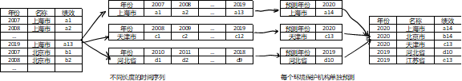

# Environment Protection DEA
 DEA Analysis of Environment Protection Investment

 **This documentation is contains math formulas in Latex format. Please browser it in contemporary markdown software.**

## Introduction

The performance evaluation of environmental protection expenditure is a "multiple input, multiple output" problem: environmental protection agencies invest different amounts of funds in different projects, and environmental protection achievements are also determined by multiple indicators (different harmful gas emissions, the recycle ratios of different rubbish). In fact, there is no fixed metric (such as rate of return in business fields) to evaluate the performance of environmental protection.

This software is a web application software that evaluates and predicts the 
performance of environmental protection agencies. This software analyzes multiple input and output indicators, and uses the [DEA algorithm](https://en.wikipedia.org/wiki/Data_envelopment_analysis) to establish a performance indicator. This indicator aims to evaluate the performance of the decision-making unit (environmental protection agencies). This software also uses the BHT-ARIMA algorithm to implement short time series forecasting, to predict the performance of environmental protection agencies in the next year.

This software can help non-statistics users to quickly implement the DEA algorithm and the BHT-ARIMA algorithm proposed by the AAAI 2020 academic conference. It uses the contemporary popular models to calculate the performance of environmental protection expenditures.

## Function

The process of software analyzing data is divided into performance evaluation and performance prediction: in the first step, the user uploads the data set, sets the input and output variables, and the software uses the data envelopment analysis algorithm to establish performance evaluation indicators. In the second step, the software extracts the year and the name of the environmental protection agency from the data set, and based on the calculated performance, uses the BHT-ARIMA algorithm to predict the performance of each environmental protection agency in the next year.

### 1.  performance evaluation

This software analyzes the performance of environmental protection agencies using the data envelopment analysis algorithm. The input data is a two-dimensional table, where each row represents a sample, which is the data of an environmental protection agency in a certain year. Each column represents 1 original indicator, and the user needs to specify one or more input indicators (such as the amount of environmental protection expenditure), one or more output indicators (such as the removal of industrial sulfur dioxide, the removal of industrial soot, the harmless treatment of domestic waste) Rate). Assuming a total of $N$ samples, the value of the input indicator of a sample i is $y_{i,1},y_{i,2},...,y_{i,k}$, the output indicator is The value is $x_{i,1},x_{i,2},...,x_{i,m}$, the performance of the sample is $θ_i$, then the value of $θ_i$ is the result of optimizing the model.
$$
\begin{aligned}
\max & \quad \theta_i = \frac{\sum_{j=1}^k y_{i,j} u_{i,j}}{\sum_{j=1}^m x_{i,j} v_{i,j}} \\
s.t. & \quad \forall n=1,2,...,N, \quad \theta_n = \frac{\sum_{j=1}^k y_{n,j} u_{n,j}}{\sum_{j=1}^m x_{n,j} v_{n,j}} \leq 1 \\
& \quad u_{i,1}, u_{i, 2}, ..., u_{i,k}, v_{i,1}, v_{i,2}, ..., v_{i, m} \geq 0
\end{aligned}
$$
Model linearization: Using the properties of 
$$
\frac{a}{b} \leq 1 \quad and \quad a,b \geq 0 \quad \Leftrightarrow \quad a-b \leq 0,
$$
the model can be transformed into the next equation,
$$
\begin{aligned}
\max & \quad \theta_i = \sum_{j=1}^k y_{i,j}u_{i,j} \\
s.t. & \quad \forall n=1,2,...,N, \sum_{j=1}^k y_{n,j}u_{n,j} - \sum_{j=1}^m x_{n,j} v_{n,j} \leq 0 \\
& \quad \sum_{j=1}^m x_{i,j}v_{i,j} = 1 \\
& \quad u_{i,1}, u_{i, 2}, ..., u_{i,k}, v_{i,1}, v_{i,2}, ..., v_{i, m} \geq 0
\end{aligned}
$$
where u, v are the internal parameters of the model, representing the weight of each input and output indicator on each sample. According to the linear programming results of this model, the performance of each sample can be obtained, and the performance value is between 0 and 1, regardless of the dimensions of the input and output indicators.

### 2. performance prediction

This software uses the BHT-ARIMA algorithm to achieve performance prediction, which is suitable for predicting the next moment value of a short time series. This software extracts the time series of the performance of environmental protection agencies over the years from the data set according to the time and decision-making unit variables set by the user in the data set. Each environmental protection agency corresponds to a time series with different lengths. The BHT-ARIMA algorithm requires the user to input 4 parameters: the number of historical items $p$ of the ARIMA model, the moving average length $q$, the difference order $d$, and the time lag parameter $τ$ of the BHT-ARIMA algorithm in the MDT process. For the detailed algorithm content, please refer to the footnotes. column of academic papers.

In performance forecasting, the software inputs the historical performance sequence of each environmental protection agency, and the software predicts the performance of the next year. The forecasting process is shown in the next figure.



## Acknowledgement

BHT-ARIMA Paper at [https://arxiv.org/abs/2002.12135](https://arxiv.org/abs/2002.12135)

BHT-ARIMA Code at [https://github.com/huawei-noah/BHT-ARIMA](https://github.com/huawei-noah/BHT-ARIMA)

[SourceHanSerifCN Font](https://github.com/wordshub/free-font#%E6%80%9D%E6%BA%90%E5%AE%8B%E4%BD%93)

## Structure

The structure of this software is like following:

![[Performance Evaluation.png]]

**User login:** This module is responsible for the user's login and registration functions. It inherits from the Authorize module of the Django function library and has the function of sending a registration confirmation email to the user.

**Task management:** This module is responsible for managing all analysis tasks, each task has independent data, models, and results; this module manages the busy state of each analysis task, collects error prompts, and maintains data sets and related information. In the analysis process, this module has the functions of creating tasks, receiving data sets, and analyzing variables.

**DEA:** This module is responsible for the data envelopment analysis algorithm, which is responsible for reading data from the task, then running the data envelopment analysis algorithm, and saving the results. There are result and download file queues in the database, 2 data tables, in which the result file saves the results of performance evaluation in the form of binary variables, and saves the list of decision-making units in the form of JSON; the download file queue is the cache of the downloaded files, when the user clicks When the "Download all data" button is pressed, the software will generate the results of the performance evaluation into a Microsoft Excel table, save it as a file, and then provide the user with a link to download the file.

**BHT-ARIMA:** This module contains the source code of the BHT-ARIMA algorithm (excluding the source code of this software, but is a running dependency of this software), and the operation control module of this software for this algorithm. This software is responsible for saving the user's parameter settings for the BHT-ARIMA algorithm, processing the data and inputting the algorithm, then running the algorithm and sorting the results. There is a parameter table and a cache of downloaded files in the database, where the parameter table saves the parameters of the model set by the user and the prediction results in the form of binary variables. When the user accesses the prediction result page, the software automatically parses the prediction result, generates HTML text and renders it on the web page; when the user clicks the "Download Results" button, the software generates a Microsoft Excel table from the prediction result, saves it as a file, and then provides the user with File download link.

## Installation

The current folder of command line is the software's project root.

### 1. Create token

Create a `token/` in project root, and include the following files in it.

(1) `django_secret_key`: There should be a string about 52 characters, being a secret key for 
communication between client and web server. The string can be generated in [Djecrety](https://djecrety.ir/) website.

(2) `smtp.json`: If you don't use a registration confirming service by email, `smtp.json` is not necessary. At the same time, you should disable registry related links in `govt_env_protection_eval_dj/urls.py`.

There should be the config of web maintainer's email sender in this file. The format is:

```json
{
  "host": "example.com",
  "port": 465,
  "username": "registration@example.com",
  "password": "anypassword"
}
```

### 2. Python environment

Install required Python packages:

```
pip install -r requirements.txt
```

It is a maximum required package. With the environment, all functions can be used, but not all functions are necessary.

Navigate to the project folder, and create the database and superuser:

```
python manage.py migrate
python manage.py createsuperuser
```

Follow the instructions in the command line. This user has the highest permission in this software.

### 3. Administrator's settings

Run the command: 

```
python manage.py 0.0.0.0:$port --insecure
```

The IP address can only be 127.0.0.1 (for local use only) or 0.0.0.0 (for web server), and `port` can be customized. After that, the website will be running at `https://example.com:$port/main`.

(1) Registry permission

1. Visit `https://example.com:$port/admin`. 
2. Create at least one group instance, for example, named "Free plan" and  users can freely register into.
3. Create a register group instance, and link to "Free plan".
4. Add proper permissions to "Free plan", at least including: "add, change, view Register", "add, delete, change, view Task", "add, delete, change, view AsyncErrorMessage", and   "add, delete, change, view Column".

